# Path Tracing Report

##### 22221332 陈九润


## 编程环境

- OS：Windows 11 Pro 22H2
- CPU: Intel(R) Core(TM) i7-8750H CPU @ 2.20GHz   2.21 GHz
- GPU: Geforce GTX 1060 6G
- RAM: 16GB
- IDE: Visual Studio 2022


## 使用说明

详见README.md

可执行文件：/bin/renderme.exe

- 开启Path Tracing：选中Path Tracing

  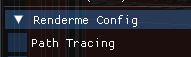

- 启用/关闭IO

  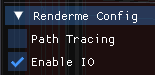

- 控制相机：WASD、CTRL、SPACE、按住右键拖动鼠标

- 场景信息：

  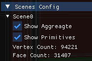


默认启动stairscase场景，可在启动时加命令行参数启动其他场景

场景配置文件位于config目录，运行方式如下：

```shell
# Run at project root path
./bin/renderme.exe /config/cornell-box.json
```


## 算法流程

源代码位于src/integrators/path-tracer.hpp和src/integrators/path-tracer.cpp

##### Path_Tracer::render()

```c++
auto Path_Tracer::render(Scene const& scene, Camera const* camera, Sampler const* sampler, Film* film) -> void
```

该函数完成一次Path Tracing迭代，并将结果存储到film中

- 将整个画面分为几个tile，每个tile由一个线程负责处理
- 在Tile内部遍历每个像素点生成光线，使用Jitter Sampler生成采样点，而后由Camera生成光线
- 调用trace函数对生成的光线执行path tracing
- 将trace函数返回的结果加入到film中并跟之前计算的值进行加权平均

##### Path_Tracer::trace

```c++
auto Path_Tracer::trace(Ray ray, Scene const& scene, int depth) -> glm::vec3
```

该函数执行一次递归的Path Tracing，并计算最终颜色值返回

- 使用上一层传入的光线与场景求交，将交点的emissive color加入结果
- 若超过最大迭代深度，则返回
- 调用mont_carlo_sample_new_ray()函数采样得到新的光线
- 递归调用trace()对新的光线进行路径追踪
- 对递归trace返回的颜色值叠加本层交点的材质
- 根据RR_PATH_TRACING_COMPUTE_DIRECT_LIGHT宏决定是否调用compute_direct_light()计算直接光照
- 返回最终颜色值

##### mont_carlo_sample_new_ray()

```c++
auto mont_carlo_sample_new_ray(Ray const& ray, Interaction const& interaction, Path_Tracer::Ray_Type* out_type, float* out_russian_roulette) -> Ray
```

该函数根据当前交点的材质、几何信息使用蒙特卡洛采样生成新的采样光线

- 若材质的折射率不为1，计算fresnel值
  - 若fresnel值小于生成的russian roulette随机数，则返回折射方向光线
  - 若fresnel值大于生成的russian roulette随机数，则返回反射方向光线
- 计算材质的diffuse、specular分量的相对大小
  - 若相对大小小于生成的russian roulette随机数，则调用brdf_importance_sample_specular()使用重要性采样返回镜面反射光线
  - 若相对大小大于生成的russian roulette随机数，则调用brdf_importance_sample_diffuse()使用重要性采样返回漫反射光线

##### 	brdf_importance_sample_diffuse() 

```c++
auto brdf_importance_sample_diffuse(glm::vec3 const& main_dir) -> glm::vec3
```

根据brdf函数使用重要性采样在半球面生成漫反射光线，main_dir为交点法向量

##### 	brdf_importance_sample_specular() 

```c++
auto brdf_importance_sample_specular(glm::vec3 const& main_dir, float specular_exponent) -> glm::vec3
```

根据brdf函数使用重要性采样在半球面生成镜面反射光线，main_dir为反射光线方向

##### compute_direct_light()

```c++
auto compute_direct_light(Interaction const& interaction, Scene const& scene) -> glm::vec3
```

遍历场景每个面光源，每个光源采样三次，生成shadow ray，计算是否照亮交点，若照亮，则将光源radiance加入计算


## 实验结果

### Stairscase

- 顶点数：94221
- 面数：31407

##### Case1

- 迭代次数1000次
- 使用10%的diffuse color作为ambient color
- 不计算直接光照

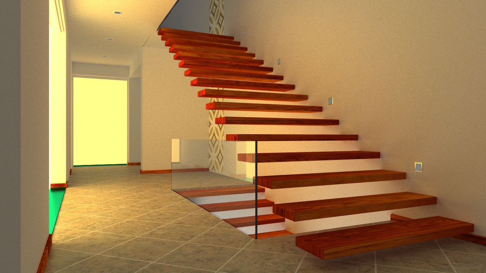


##### Case2

- 迭代次数50次
- 不使用ambient color
- 计算直接光照

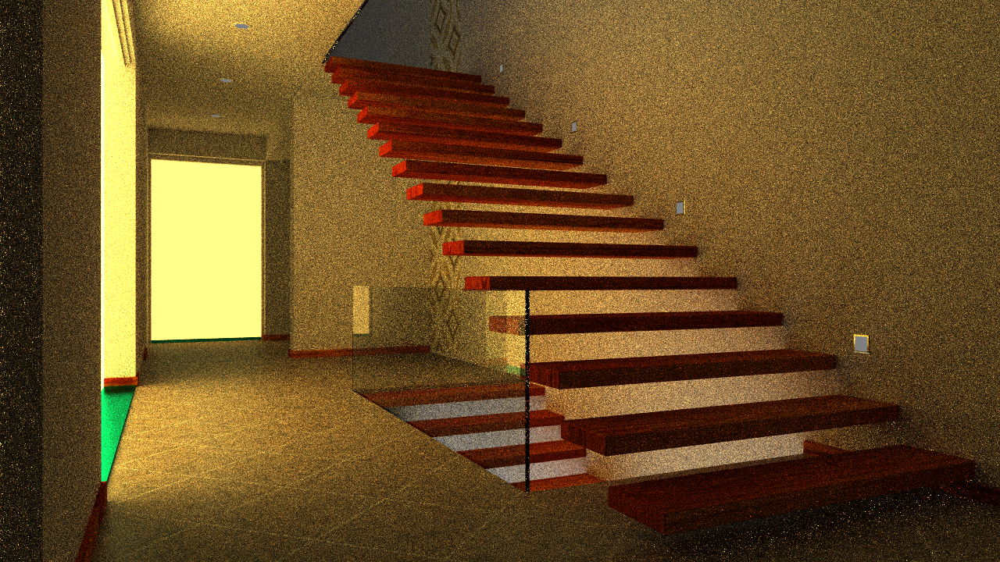

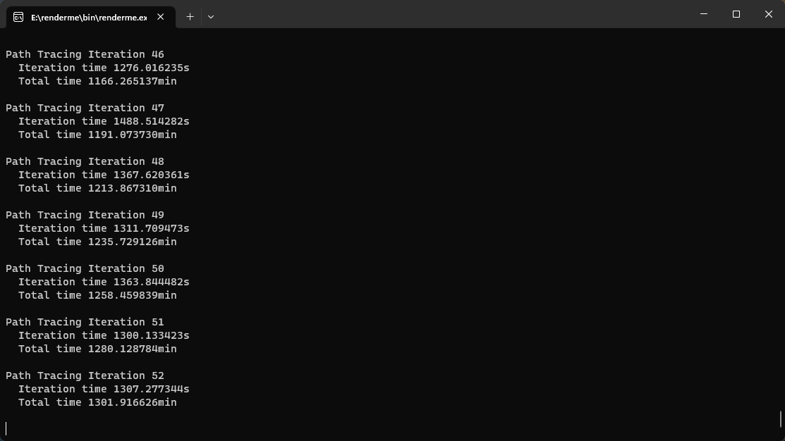


### Cornell Box

- 顶点数：704835
- 面数：234945

##### Case1

- 迭代次数1000次
- 使用10%的diffuse color作为ambient color
- 不计算直接光照
- 由于box顶部的灯光与盒子顶部y值相同，导致与其求交的结果可能为跟盒子顶部求交结果，因此将该光源向下平移了0.8

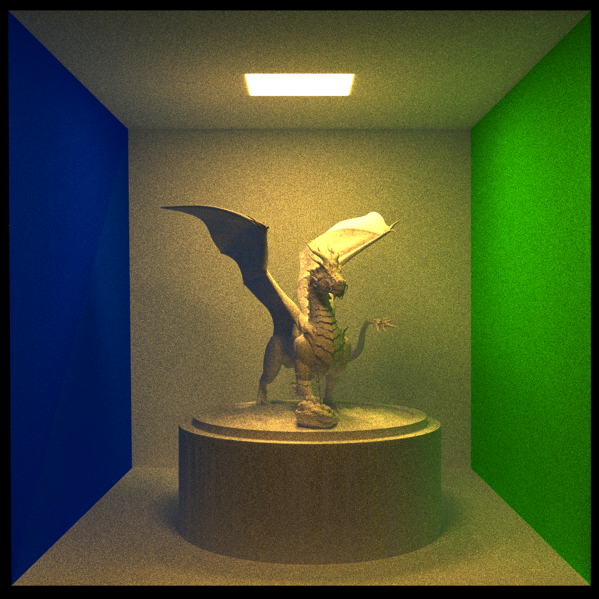


##### Case2

- 迭代次数1000次
- 不加入ambient color
- 计算直接光照
- 由于box顶部的灯光与盒子顶部y值相同，导致与其求交的结果可能为跟盒子顶部求交结果，因此将该光源向下平移了0.8

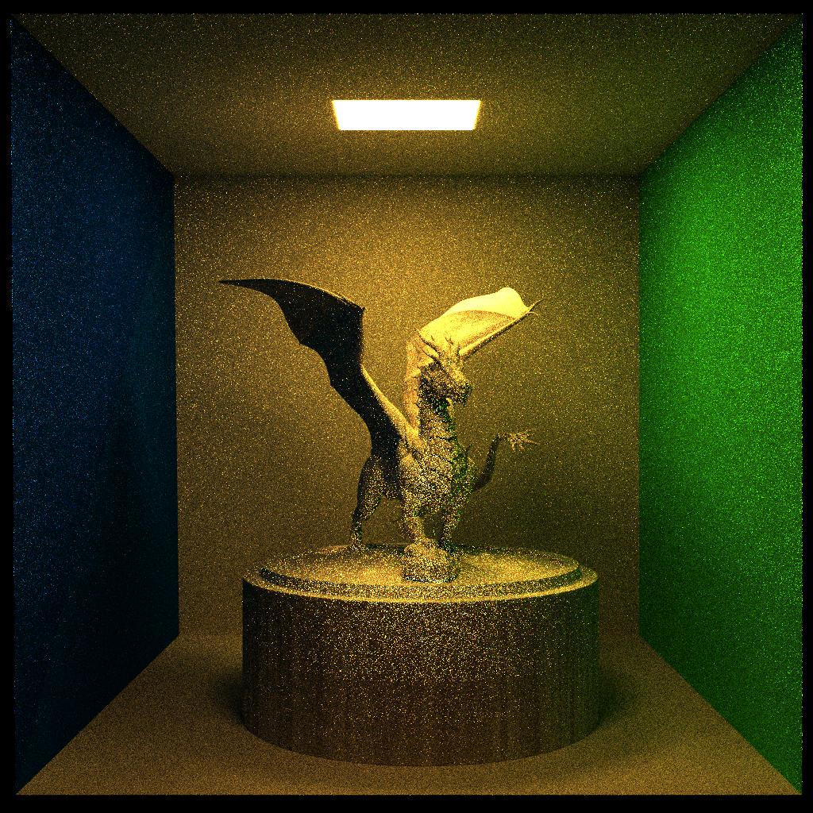

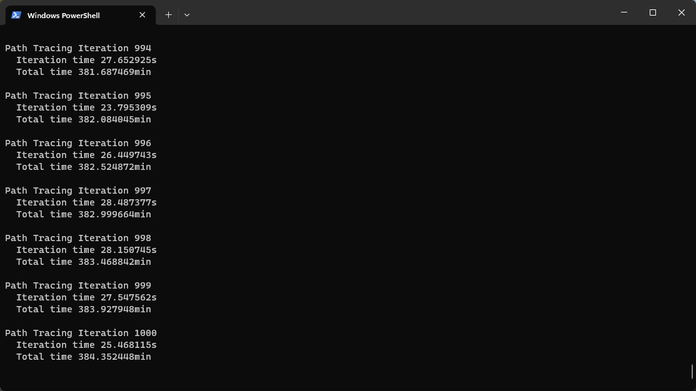


### Veach Mis

- 顶点数：6996
- 面数：2332

##### Case1

- 迭代次数1000次
- 使用10%的diffuse color作为ambien
- 不计算直接光照

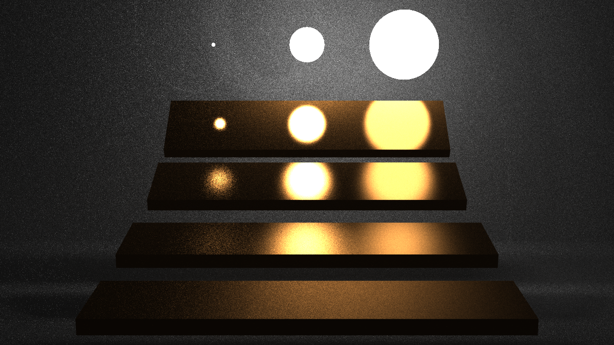

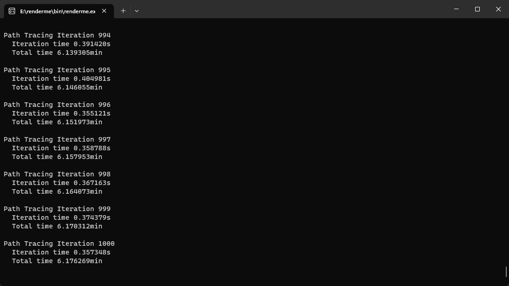
